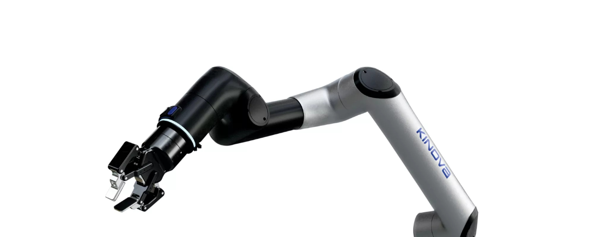
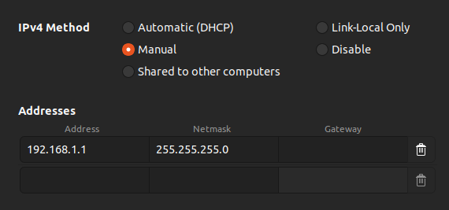
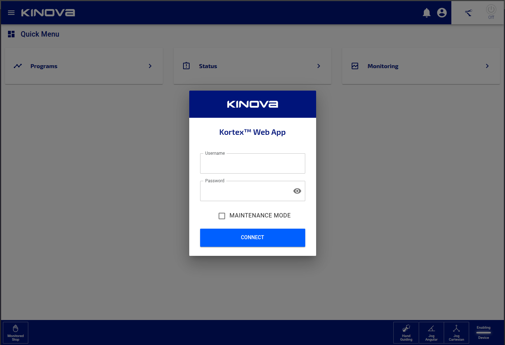
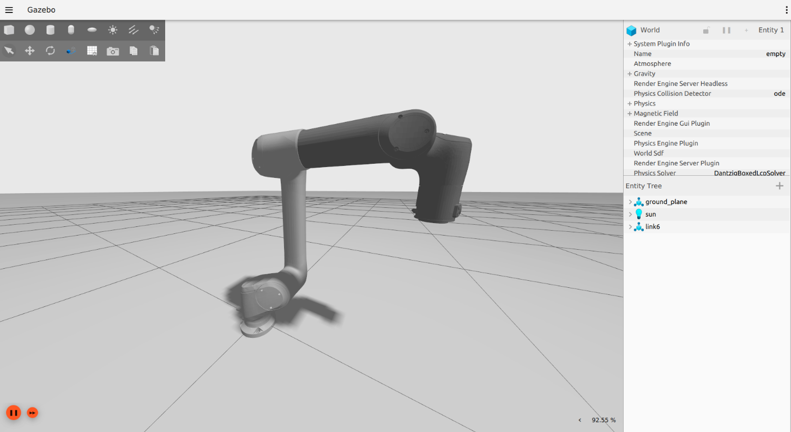
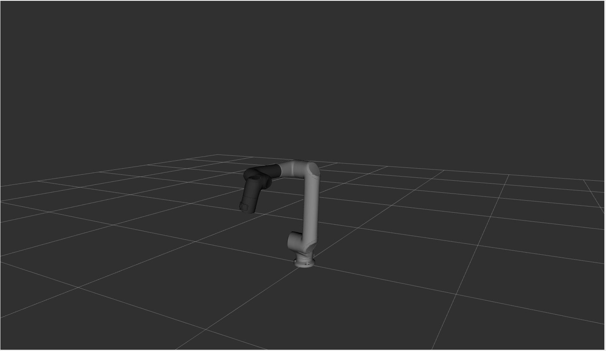
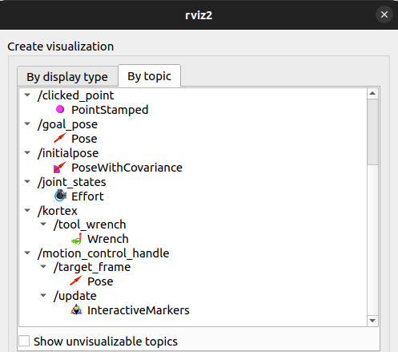
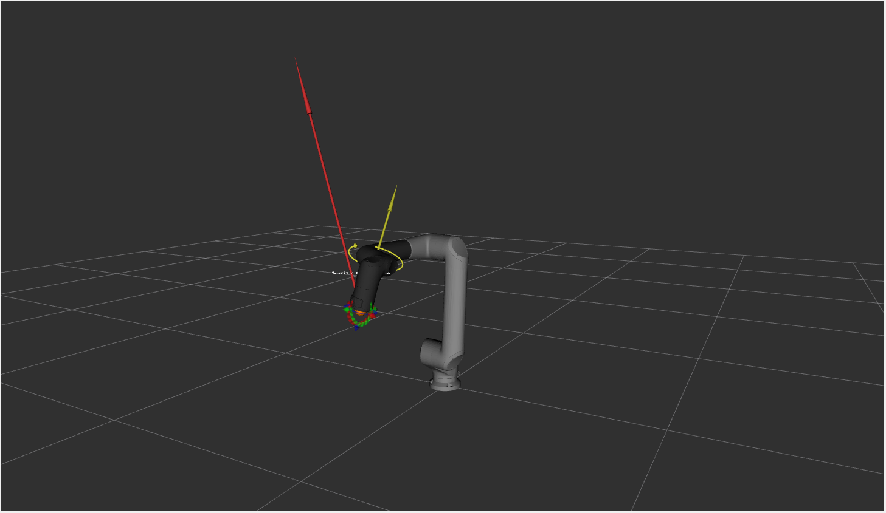
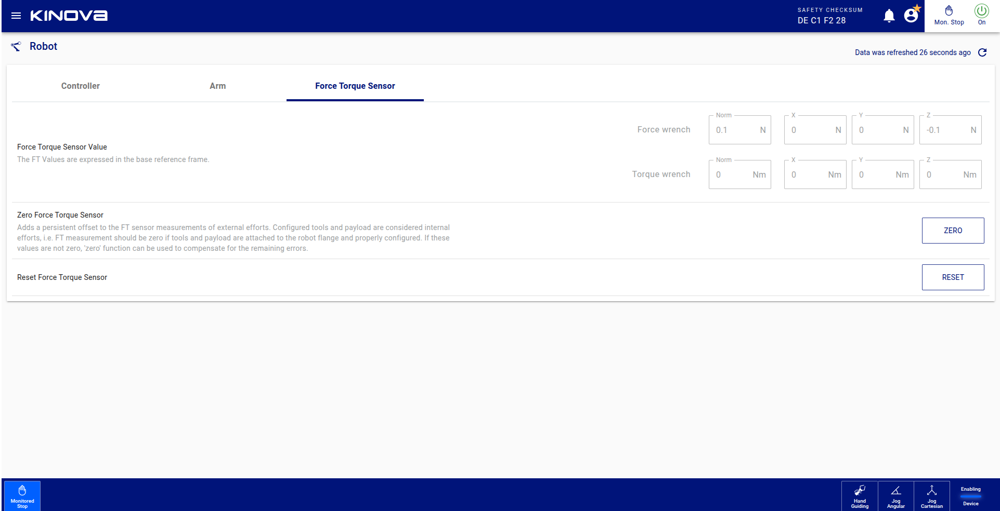

# ROS2 Kortex 3
> Kinova® Kortex3™ is the common software platform behind the Link6. It unifies the robot's inner workings their related external tools, like the API.  
> https://www.kinovarobotics.com/product/link-6-cobot

<p align="center">
  
</p>

ROS2 Kortex3 is the official ROS2 package to interact with the Kinova Link6 robot. It is built upon the Kinova® Kortex3™ API, documentation for which can be found in the [GitHub Kortex3 repository](https://github.com/Kinovarobotics/Kinova-Kortex3-Link6).

This repository includes two ROS2 drivers:

- For teleoperation and high-level features such as configuring the robot and running pre-made programs, use the default [High-level driver](#212-real-hardware).
- For high-speed autonomous operation, use the [Low-level driver](#213-low-level-driver).

> [!CAUTION]
> The Link6 is a powerful robot that can perform heavy duty industrial tasks. Read and understand all safety considerations before installing and using the robot. Refer to the [Link6 User Guide](https://artifactory.kinovaapps.com/ui/api/v1/download?repoKey=generic-documentation-public&path=Documentation%252FLink%25206%252FTechnical%2520documentation%252FUser%2520Guide%252FEN-UG-020-Link-6-user-guide-r4.2.pdf) for more information.

> [!IMPORTANT]
> The Link6 ROS2 driver requires your robot to be updated to the Firmware version 3.4.0.

This package is under active development. Users are encouraged to report any bugs via the GitHub Issues page.

## Table of Contents

- [ROS2 Kortex 3](#ros2-kortex-3)
  - [Table of Contents](#table-of-contents)
  - [1. Getting Started](#1-getting-started)
    - [1.1 Prerequisites](#11-prerequisites)
    - [1.2 Installation](#12-installation)
    - [1.3 Setting up the robot](#13-setting-up-the-robot)
  - [2. Usage](#2-usage)
    - [2.1 Quick Launch](#21-quick-launch)
      - [2.1.1 Simulation](#211-simulation)
      - [2.1.2 Real Hardware](#212-real-hardware)
      - [2.1.3 Low-level Driver](#213-low-level-driver)
    - [2.2 Controllers \& Commands](#22-controllers--commands)
      - [2.2.1 Listing \& Switching Controllers](#221-listing--switching-controllers)
      - [2.2.2 Joint Trajectory Controller](#222-joint-trajectory-controller)
      - [2.2.3 Cartesian Motion Controller](#223-cartesian-motion-controller)
      - [2.2.4 Joint Velocity Controller](#224-joint-velocity-controller)
      - [2.2.5 Robotiq Gripper Controller](#225-robotiq-gripper-controller)
      - [Real-life Control:](#real-life-control)
      - [2.2.6 Twist Controller](#226-twist-controller)
      - [Simulation Control:](#simulation-control)
    - [2.4 MoveIt Integration](#24-moveit-integration)
      - [2.4.1 Real Hardware](#241-real-hardware)
      - [2.4.2 Simulation](#242-simulation)
  - [4. Services \& Fault Handling](#4-services--fault-handling)
    - [4.1 Operating Modes](#41-operating-modes)
    - [4.2 Switching Modes](#42-switching-modes)
    - [4.3 Fault Handling](#43-fault-handling)
    - [4.4 Interaction with the Webapp Programs via ROS2](#44-interaction-with-the-webapp-programs-via-ros2)
      - [4.4.1 Listing the Available Programs](#441-listing-the-available-programs)
      - [4.4.2 Running a Specific Program](#442-running-a-specific-program)
      - [4.4.3 Stopping a Running Program](#443-stopping-a-running-program)
      - [4.4.4 Checking Program Status](#444-checking-program-status)
      - [4.4.5 Complete Workflow Example](#445-complete-workflow-example)
      - [4.5 Protection Zones Information](#45-protection-zones-information)
  - [5. Visualization](#5-visualization)
    - [5.1 RViz Setup](#51-rviz-setup)
    - [5.2 Interactive Marker Control](#52-interactive-marker-control)
    - [5.3 Force/Torque Zeroing](#53-forcetorque-zeroing)
  - [6. Package Overview](#6-package-overview)
    - [kortex3\_hardware](#kortex3_hardware)
    - [link6\_description](#link6_description)
    - [link6\_control](#link6_control)
    - [link6\_bringup](#link6_bringup)
  - [Future Developments](#future-developments)
  - [Limitations](#limitations)
  - [Authors](#authors)

---

## 1. Getting Started

### 1.1 Prerequisites

1. **ROS2 Humble** on Ubuntu 22.04  
    Follow the official guide:  
    https://docs.ros.org/en/humble/Installation/Ubuntu-Install-Debs.html

2. **Ignition Fortress (Gazebo)**  
    See the guide here:  
    https://gazebosim.org/docs/fortress/ros_installation/

3. **System dependencies**
    ```bash
    sudo apt update
    sudo apt install wget git-lfs python3-colcon-common-extensions python3-vcstool python3-rosdep -y
    git lfs install
    ```

4. **Protobuf v3.20.3**  
    The Kortex API bindings require exactly Protobuf 3.20.3 and to install it from source please run the following commands:

    ```bash
    cd /tmp
    wget https://github.com/protocolbuffers/protobuf/releases/download/v3.20.3/protobuf-cpp-3.20.3.tar.gz
    tar -xzf protobuf-cpp-3.20.3.tar.gz
    cd protobuf-3.20.3
    ./configure --prefix=/usr/local
    make -j$(nproc)
    sudo make install
    sudo ldconfig
    ```

    Finally the installed protobuf version can be verified using the following command:
    
    ```bash
    /usr/local/bin/protoc --version
    ```

5. **Additional ROS packages**

    ```bash
    sudo apt update
    sudo apt install \
    ros-humble-gz-ros2-control \
    ros-humble-gz-ros2-control-demos \
    ros-humble-gripper-controllers
    ```

### 1.2 Installation

1. Create a new ROS2 workspace:

    ```bash
    export COLCON_WS=~/workspace/link6_ws
    mkdir -p $COLCON_WS/src
    cd $COLCON_WS/src
    ```

2. Clone this repository:

    ```bash
    git clone https://github.com/Kinovarobotics/ros2_link6.git -b humble
    ```

3. Retrieve the kortex 3 library:

    ```bash
    cd ros2_link6
    git lfs pull
    ```

4. Rearrange the directories:

    ```bash
    cd $COLCON_WS
    shopt -s dotglob
    mv src/ros2_link6/* src/ && rm -rf src/ros2_link6
    ```

    At this point, your directories tree should looks as follows:

    ```
    link6_ws/
    └── src/
        ├── doc/
        ├── kortex3_hardware/
        ├── link6_bringup/
        ├── link6_control/
        ├── link6_description/
        ├── ros2_link6.humble.repos
        ├── LICENSE
        └── README.md
    ```

5. Clone additional repositories:
    ```bash
    cd $COLCON_WS
    vcs import src --skip-existing --input src/ros2_link6.$ROS_DISTRO.repos
    ```

6. Install Dependencies

    ```bash
    cd $COLCON_WS
    rosdep update
    rosdep install --ignore-src --from-paths src -r -y
    ```

7. Build & Source

    ```bash
    colcon build --packages-skip cartesian_controller_simulation cartesian_controller_tests --cmake-args -DCMAKE_BUILD_TYPE=Release
    ```

    Source the previously built workspace by using the following command:

    ```bash
    source $COLCON_WS/install/setup.bash
    ```

    You can make it automatic by adding it to your `~/.bashrc`:

    ```bash
    echo "source $COLCON_WS/install/setup.bash" >> ~/.bashrc
    source ~/.bashrc
    ```

### 1.3 Setting up the robot

1. **Power on the Link6** until the status LED is solid green.

2. **Connect Ethernet** to your PC.

3. **Configure your PC’s interface** (Link6 defaults to 192.168.1.10/24):

    ```bash
    sudo ip addr add 192.168.1.20/24 dev <your_eth_if>
    sudo ip link set <your_eth_if> up
    ping 192.168.1.10
    ```

    <p align="center">
      
    </p>

4. **Verify** by browsing to:
    [http://192.168.1.10/dashboard](http://192.168.1.10/dashboard)

    <p align="center">
      
    </p>

5. **Extract calibration data**

    Each Kinova Link6 is calibrated in the factory. This data can be extracted from the robot and used to apply robot-specific geometric corrections to the URDF files, improving positional accuracy. Although this step is not mandatory, it is highly recommended to avoid end-effector position errors.

    To extract the the calibration data, navigate to [http://192.168.1.10/dashboard](http://192.168.1.10/dashboard) and follow this proceedure:

    1. Tap Systems > Robot > Arm > Calibration.
    2. Tap EXPORT in the Export calibration file pane.
    3. Select a directory in your computer to store the calibration files.
    4. Tap EXPORT.

    This will download a compressed file (`.zip`) in the directory you selected. Uncompress it to obtain a `.yaml` calibration file. This file can later be used when bringing up the robot (see [Section 2. Usage](#2-usage)).

---

## 2. Usage

### 2.1 Quick Launch

#### 2.1.1 Simulation

<p align="center">
  
</p>

To bringup a simulated Link6, use the following:

```bash
export GZ_SIM_RESOURCE_PATH=$GZ_SIM_RESOURCE_PATH:$(ros2 pkg prefix link6_description)/share:$(ros2 pkg prefix robotiq_description)/share
ros2 launch link6_bringup link6_sim.launch.py gripper:=robotiq_2f_85 calibration_file:=/path/to/calibration/folder/calibration.yaml
```

The accepted arguments are:

* `gripper` : Gripper to use. Possible values are either `robotiq_2f_85` or `robotiq_2f_140`. Default value is an empty string, which will display the arm without a gripper.

* `calibration_file` : Full path to the calibration file extracted on [1.3 Setting up the robot](#13-setting-up-the-robot). If no calibration file is specified, the system will use the default calibration from `link6_description/config/default_calibration.yaml`.

#### 2.1.2 Real Hardware

To bringup a real life Link6, use the following:

```bash
ros2 launch link6_bringup link6.launch.py
```

The accepted arguments are:

* `gripper` : Gripper to use. Possible values for the Gen3 are either `robotiq_2f_85`, `robotiq_2f_140` or `""`. Default is `""`. An empty string will not initialise any gripper.

* `gripper_joint_name` : Name of the controlled joint of the gripper attached to the arm. Default value is `robotiq_85_left_knuckle_joint`.

* `use_internal_bus_gripper_comm` : Use internal bus for gripper communication. Default value is `true`.

* `calibration_file` : Full path to the calibration file extracted on [1.3 Setting up the robot](#13-setting-up-the-robot). If no calibration file is specified, the system will use the default calibration from `link6_description/config/default_calibration.yaml`.

* `robot_ip` : IP address by which the robot can be reached. Default value is `192.168.1.10`. If you have reassigned your physical arm's robot IP address, you will need to assign that ip address.

* `username` : Username to start a session to interact with the robot. Default value is `admin`.

* `password` : Password to start a session to interact with the robot. Default value is `admin`.

#### 2.1.3 Low-level Driver

The default ROS2 driver uses a low-frequency MQTT connection to send commands to the arm. For applications that require fast, reactive control, achieving a higher frequency is essential. For such cases, we provide an alternative low-level driver that uses UDP to send joint position commands at up to 1kHz. To use it, make sure your Link6 controller firmware is up to date.

To launch the real robot in low-level mode, use the following command:

```bash
ros2 launch link6_bringup link6_low_level.launch.py
```

This launch file accept the same parameters as the default one:

* `gripper` : Gripper to use. Possible values for the Gen3 are either `robotiq_2f_85`, `robotiq_2f_140` or `""`. Default is `""`. An empty string will not initialise any gripper.

* `gripper_joint_name` : Name of the controlled joint of the gripper attached to the arm. Default value is `robotiq_85_left_knuckle_joint`.

* `use_internal_bus_gripper_comm` : Use internal bus for gripper communication. Default value is `true`.

* `calibration_file` : Full path to the calibration file extracted on [1.3 Setting up the robot](#13-setting-up-the-robot). If no calibration file is specified, the system will use the default calibration from `link6_description/config/default_calibration.yaml`.

* `robot_ip` : IP address by which the robot can be reached. Default value is `192.168.1.10`. If you have reassigned your physical arm's robot IP address, you will need to assign that ip address.

* `username` : Username to start a session to interact with the robot. Default value is `admin`.

* `password` : Password to start a session to interact with the robot. Default value is `admin`.

* `safety_mode` : Safety system mode applied when the low-level position controller is activated. `reduced` enforces slower joint speed limits, while `normal` allows the full speed envelope. Default value is `reduced`.
  
> [!IMPORTANT]
> The low-level driver operates in **Hold-to-Run** mode by default. The arm will only execute motion commands while the **Enabling Device** (the 3-position enabling switch) is held in the intermediate (enabled) position. Releasing or fully pressing the enabling device will stop the arm immediately.

**Note:** For the moment, the low-level driver doesn't support the features mentioned in section [Services & Fault Handling](#4-services--fault-handling).

### 2.2 Controllers & Commands

By default our `controller_manager` brings up:

| Controller                        | Type                                                    | Purpose                          | Input Topic / Interface                                   |
| :-------------------------------- | :------------------------------------------------------ | :------------------------------- | :-------------------------------------------------------- |
| **joint\_state\_broadcaster**     | `joint_state_broadcaster/JointStateBroadcaster`         | Publish all joint states         | `/joint_states` (sensor\_msgs/JointState)                 |
| **joint\_trajectory\_controller**   | `joint_trajectory_controller/JointTrajectoryController`     | Joint trajectory commands | `/joint_trajectory_controller/joint_trajectory` (trajectory_msgs/msg/JointTrajectory) |
| **joint\_velocity\_controller**   | `velocity_controllers/JointGroupVelocityController`     | Low‑level joint‑space velocities | `/joint_velocity_controller/commands` (std_msgs/msg/Float64MultiArray) |
| **cartesian\_motion\_controller** | `cartesian_motion_controller/CartesianMotionController` | Cartesian pose tracking *(high-level driver only)*         | `/cartesian_motion_controller/target_frame` (geometry_msgs/msg/PoseStamped)  |
| **robotiq\_gripper\_controller** | `position_controllers/GripperActionController` | Gripper opening/closing control          | `/robotiq_gripper_controller/gripper_cmd` (control_msgs/action/GripperCommand)  |
| **motion\_control\_handle**       | `cartesian_controller_handles/MotionControlHandle`      | RViz interactive‑marker handle *(high-level driver only)*  | —                                                         |
| **twist\_controller**             | `picknik_twist_controller/PicknikTwistController`       | Cartesian-space velocity commands *(low-level driver only)* | `/twist_controller/commands` (geometry_msgs/msg/Twist)   |

#### 2.2.1 Listing & Switching Controllers

```bash
ros2 control list_controllers
```

Switch controllers by activating the desired one and deactivating the not-needed other.

For example: Activate Cartesian motion controller and stop joint velocity controller:

```bash
ros2 control switch_controllers \
  --activate cartesian_motion_controller \
  --deactivate  joint_velocity_controller
```

#### 2.2.2 Joint Trajectory Controller

> **Use‑case:** direct joint trajectory commands.
> **Type:** `joint_trajectory_controller/JointTrajectoryController`

1. Activate (see above).
2. Publish a trajectory:

  ```bash
  ros2 topic pub /joint_trajectory_controller/joint_trajectory trajectory_msgs/JointTrajectory "{
    joint_names: [joint_1, joint_2, joint_3, joint_4, joint_5, joint_6],
    points: [
      { positions: [0, 0, 0, 0, 0, 0], time_from_start: { sec: 10 } },
    ]
  }" -1
  ```

#### 2.2.3 Cartesian Motion Controller

> **Use‑case:** smooth end‑effector motion via RViz handle or programmatic targets. Only available with the [High-level Driver](#212-real-hardware).
> **Type:** `cartesian_motion_controller/CartesianMotionController`

1. **Activate** it (see above).

2. **Safety Warning:** The controller drives the end effector toward `target_frame` with a velocity proportional to the pose error. If the commanded target is far from the robot's **current** pose, the resulting error is large and the robot will move at **high velocity**, which can be dangerous. **Never send an arbitrary absolute target as your first command.** Always seed the target with the current pose and then move in small increments. 

3. **Read the current end-effector pose** (relative to `base_link`):                                                                

    ```bash
    ros2 run tf2_ros tf2_echo base_link end_effector_link             
    ```                                                               

Note the reported `Translation` (x, y, z) and `Rotation` quaternion (x, y, z, w).

4. **Send target pose** and make sure it is reasonably close to the current pose:

    ```bash
    ros2 topic pub --once /cartesian_motion_controller/target_frame geometry_msgs/msg/PoseStamped "{header: {frame_id: 'base_link'}, pose: {position: {x: <double>, y: <double>, z: <double>}, orientation: {x: <double>, y: <double>, z: <double>, w: <double>}}}"
    ```

#### 2.2.4 Joint Velocity Controller

> **Use‑case:** direct joint‑space velocity commands.
> **Type:** `velocity_controllers/JointGroupVelocityController`

1. Activate (see above).
2. Publish velocities:

   ```bash
   ros2 topic pub /joint_velocity_controller/commands std_msgs/msg/Float64MultiArray "{ data: [0, 0, 0, 0, 0, 0.1] }" --once
   ```
   
Ensure your `data` array matches the `joints:` ordering in your controller yaml.
**NOTE:** Make sure that whenever you send joint velocities, you send a zero velocity command afterward; otherwise the robot will keep moving based on the last velocity sent.

#### 2.2.5 Robotiq Gripper Controller
> **Use‑case:** control of the opening/closing of a mounted Robotiq gripper

> **Type:** `position_controllers/GripperActionController`

#### Real-life Control:

The gripper position is commanded in **radians**, matching the actuated joint in the URDF (`0.0` = fully open, and the joint's upper limit = fully closed: **`0.8` for the 2f_85**, `0.7` for the 2f_140).

1. Fully open the gripper:
```bash
ros2 action send_goal /robotiq_gripper_controller/gripper_cmd control_msgs/action/GripperCommand "{command:{position: 0.0, max_effort: 100.0}}"
```

2. Fully close the gripper (2f_85):
```bash
ros2 action send_goal /robotiq_gripper_controller/gripper_cmd control_msgs/action/GripperCommand "{command:{position: 0.8, max_effort: 100.0}}"
```

3. You can partially close the gripper by setting the position to any value between `0.0` (fully open) and the closed limit (`0.8` for the 2f_85), for example half-closed:
```bash
ros2 action send_goal /robotiq_gripper_controller/gripper_cmd control_msgs/action/GripperCommand "{command:{position: 0.4, max_effort: 100.0}}"
```

**NOTE** Some grippers include an extra rubber layer on the fingertips which will affect the closing position value

#### 2.2.6 Twist Controller

> **Use‑case:** reactive end-effector velocity control in Cartesian space with respect to the **tool frame**. Only available with the [Low-level Driver](#213-low-level-driver).
> **Type:** `picknik_twist_controller/PicknikTwistController`

1. Activate (see above):

   ```bash
   ros2 control switch_controllers \
     --activate twist_controller \
     --deactivate joint_trajectory_controller
   ```

2. Publish a twist command (e.g., move at 2 cm/s along X):

   ```bash
   ros2 topic pub /twist_controller/commands geometry_msgs/msg/Twist "{
     linear: {x: 0.02, y: 0.0, z: 0.0},
     angular: {x: 0.0, y: 0.0, z: 0.0}
   }" --once
   ```

**NOTE:** Always publish a zero-velocity twist to stop the arm after motion, as the controller keeps applying the last received command.

> [!IMPORTANT]
> This controller requires the arm to be in **Hold-to-Run** mode (see [Low-level Driver](#213-low-level-driver)). The arm will stop as soon as the Enabling Device is released.

#### Simulation Control:

1. Fully open the gripper:
```bash
ros2 action send_goal /robotiq_gripper_controller/gripper_cmd control_msgs/action/GripperCommand "{command:{position: 0.1, max_effort: 100.0}}"
```

2. Fully close the gripper:
```bash
ros2 action send_goal /robotiq_gripper_controller/gripper_cmd control_msgs/action/GripperCommand "{command:{position: 0.7, max_effort: 100.0}}"
```

3. You can partially open the gripper by calling the Action server with the previous command and setting the desired position of the gripper to any number between 0.0 (Fully Open) and 0.7 (Fully Closed), for example:
```bash
ros2 action send_goal /robotiq_gripper_controller/gripper_cmd control_msgs/action/GripperCommand "{command:{position: 0.5, max_effort: 100.0}}"
```

### 2.4 MoveIt Integration

#### 2.4.1 Real Hardware

To use MoveIt with a real life Link6, first bringup the robot:

```bash
ros2 launch link6_bringup link6.launch.py gripper:=robotiq_2f_85 calibration_file:=/path/to/your_robot_calibration.yaml
```

Then activate the joint_trajectory_controller (refer to section 6.2.1)

Then start MoveIt:

```bash
ros2 launch link6_moveit_config move_group.launch.py use_rviz:=true
```

#### 2.4.2 Simulation

**Simulation (Ignition/Gazebo Harmonic)**

To use MoveIt with a simulated Link6, first bringup the robot:

```bash
ros2 launch link6_bringup sim_robot.launch.py gripper:=robotiq_2f_85 calibration_file:=/path/to/your_robot_calibration.yaml
```

Then activate the joint_trajectory_controller (refer to section 6.2.1)

Then start MoveIt:
```bash
ros2 launch link6_moveit_config move_group.launch.py use_sim_time:=true use_rviz:=true
```

---

## 4. Services & Fault Handling

### 4.1 Operating Modes

| Value | Mode Name       | Description                                            |
| ----: | :-------------- | :----------------------------------------------------- |
|     0 | UNSPECIFIED     | No particular mode; used as a placeholder              |
|     1 | JOG\_MANUAL     | Joint‑by‑joint manual jogging                          |
|     2 | HAND\_GUIDING   | Gravity‑compensation free‑hand guiding                 |
|     3 | HOLD\_TO\_RUN   | Press‑and‑hold to enable motion                        |
|     4 | AUTO            | Fully autonomous execution (default for ROS 2 Control) |
|     5 | MONITORED\_STOP | Safe stop (holds position, zero torque)                |

### 4.2 Switching Modes

Call the `SetOperatingMode` service to change modes at runtime:

```bash
ros2 service call /kortex3_hardware/set_operating_mode \
  kortex3_hardware/srv/SetOperatingMode "{ operating_mode: <MODE_VALUE> }"
```

*Example: switch to **AUTO** (mode 4)*

```bash
ros2 service call /kortex3_hardware/set_operating_mode \
  kortex3_hardware/srv/SetOperatingMode "{ operating_mode: 4 }"
```

**NOTE** Both unspecified and hand_guiding modes cannot be set using ROS since the first mode is just a placeholder and the second one requires pressing the arm's button during operation for safety reasons. Moreover, sometimes it is required to go through monitored stop mode before switching to other modes.

### 4.3 Fault Handling

If the arm enters a fault state (e.g. emergency stop, self-collision), you will see:

```
[ERROR] Robot arm is in FAULT ...
```

To clear faults and return the arm to `OPERATIONAL`:

```bash
ros2 service call /kortex3_hardware/clear_faults \
  kortex3_hardware/srv/ClearFaults "{}"
```

On success you’ll get back:

```yaml
success: true
message: "Faults cleared and arm recovered to OPERATIONAL."
```

Note: In most cases, errors require the user to hand guide the robot out of the recovery state. Therefore, please make sure to follow the terminal instructions where the launch file was started.

### 4.4 Interaction with the Webapp Programs via ROS2

Additional services are available to interact with the programs that were previously created and saved on the robot controller via the web application. This covers listing, running, stopping programms as well as reading the status of the program runner.

**Important Safety Note:** Before running any program through ROS2, ensure that all motion controllers (especially `joint_velocity_controller`, `cartesian_motion_controller`, and `motion_control_handle`) are deactivated. The hardware interface includes automatic safety checks to prevent conflicts between ROS2 controllers and program execution.

#### 4.4.1 Listing the Available Programs

To retrieve a list of all programs stored on the robot controller:

```bash
ros2 service call /kortex3_hardware/list_programs \
  kortex3_hardware/srv/ListPrograms "{}"
```

**Example Response:**

```yaml
success: true
message: "Found 3 program(s)."
programs:
  - identifier: 1
    name: "<program_name>"
  - identifier: 2
    name: "HomePosition"
  - identifier: 3
    name: "CalibrationRoutine"
```

The response contains a list of all available programs with their names and internal identifiers. Use the program names when calling the `run_program` service.

#### 4.4.2 Running a Specific Program

To execute a program by its name (obtained from the list above):

```bash
ros2 service call /kortex3_hardware/run_program \
  kortex3_hardware/srv/RunProgram "{program_name: '<program_name>'}"
```

**Parameters:**
- `program_name` (string): The name of the program to run (as shown in list_programs)

**Example Success Response:**

```yaml
success: true
message: "Program '<program_name>' (ID: 1) started successfully."
```

**Example Error Response (if program not found):**

```yaml
success: false
message: "Program 'NonExistentProgram' not found. Use list_programs service to see available programs."
```

**Example Error Response (if controllers are active):**

```yaml
success: false
message: "Cannot execute program: The following motion controllers are active: joint_velocity_controller, cartesian_motion_controller. Please stop these controllers before running a program."
```

**Safety Features:**
- Programs are referenced by name for improved usability
- Automatic lookup of program ID from name
- Velocity commands are automatically blocked while a program is running
- Commands remain blocked for 1 second after program completion to prevent interference
- Active motion controllers are automatically detected and prevent program execution

#### 4.4.3 Stopping a Running Program

To stop the currently executing program:

```bash
ros2 service call /kortex3_hardware/stop_program \
  kortex3_hardware/srv/StopProgram "{}"
```

**Example Response:**

```yaml
success: true
message: "Program stopped successfully and operating mode set to AUTO."
```

**Behavior:**
- Stops the currently running program immediately
- Automatically switches the operating mode back to AUTO
- The robot will decelerate safely according to its motion parameters
- After stopping, ROS2 velocity controllers can be activated and used again

#### 4.4.4 Checking Program Status

To query the current status of the program runner:

```bash
ros2 service call /kortex3_hardware/get_program_status \
  kortex3_hardware/srv/GetProgramStatus "{}"
```

**Example Response:**

```yaml
success: true
status: "RUNNING"
message: "Program runner status: RUNNING"
```

**Possible Status Values:**
- `IDLE`: No program is running
- `STARTING`: Program is initializing
- `RUNNING`: Program is actively executing
- `PAUSED`: Program execution is paused
- `PAUSED_AUTOMATIC_RESUME`: Program paused but will resume automatically
- `STOPPING`: Program is in the process of stopping
- `WAITING_FOR_ACKNOWLEDGE`: Program is waiting for user acknowledgment
- `UNSPECIFIED`: Status could not be determined

#### 4.4.5 Complete Workflow Example

Here's a complete example workflow for executing a program:

```bash
# 1. List available programs
ros2 service call /kortex3_hardware/list_programs \
  kortex3_hardware/srv/ListPrograms "{}"

# 2. Stop any active motion controllers
ros2 service call /controller_manager/switch_controller controller_manager_msgs/srv/SwitchController "{
  deactivate_controllers: [joint_velocity_controller, cartesian_motion_controller, motion_control_handle],
  strictness: 1,
  activate_asap: true,
}"


# 3. Run the desired program (e.g., '<program_name>')
ros2 service call /kortex3_hardware/run_program \
  kortex3_hardware/srv/RunProgram "{program_name: '<program_name>'}"

# 4. Monitor the program status
ros2 service call /kortex3_hardware/get_program_status \
  kortex3_hardware/srv/GetProgramStatus "{}"

# 5. (Optional) Stop the program if needed
# Note: This automatically switches the operating mode back to AUTO
ros2 service call /kortex3_hardware/stop_program \
  kortex3_hardware/srv/StopProgram "{}"

# 6. Reactivate controllers after program completion
# The operating mode is already AUTO after stopping, so controllers can be activated
ros2 control switch_controllers \
  --activate cartesian_motion_controller
```

#### 4.5 Protection Zones Information

The hardware interface provides a service to list protection zones that have been created in the web application.

**Important Note:**
- Protection zones can only be **created, configured, enabled, and disabled** through the web interface
- The ROS2 service below provides read-only information about existing zones
- Use the web interface → Safety → Protection Zones for all zones management

**List Protection Zones:**

```bash
ros2 service call /kortex3_hardware/list_protection_zones \
  kortex3_hardware/srv/ListProtectionZones "{}"
```

**Example Response:**

```yaml
success: true
message: "Found 2 protection zone(s)."
zones:
  - identifier: 1
    name: "WorkArea"
    is_enabled: true
  - identifier: 2
    name: "RestrictedZone"
    is_enabled: false
```

This service is useful for monitoring which protection zones are currently defined and their states.

---

## 5. Visualization

### 5.1 RViz Setup

In a new terminal, source your workspace and run RViz with the provided configuration file. This will load the robot model and all necessary displays.

```bash
ros2 run rviz2 rviz2 \
-d $(ros2 pkg prefix link6_control)/share/link6_control/config/link6_config.rviz
```

<p align="center">
  
</p>

### 5.2 Interactive Marker Control

When launching rviz, the interactive marker handle is off by default. To control the robot by dragging a marker in RViz, you must activate the motion\_control\_handle and cartesian\_motion\_controller and deactivate any other motion controller (like joint_trajectory_controller):

```bash
ros2 control switch_controllers --activate motion_control_handle cartesian_motion_controller --deactivate joint_trajectory_controller
```

If the interactive marker is not on the side menu of rviz, then you can add it by clicking on Add button and in the by topic tab, select /tool\_wrench/Wrench.

<p align="center">
  
</p>

### 5.3 Force/Torque Zeroing

The wrench visual might have non-calibrated force/torque readings and will show something like this:

<p align="center">
  
</p>

You can open the web app go on the side menu and select robot. Once that is done select, Force Torque Sensor, and click the ZERO button.

<p align="center">
  
</p>

---

## 6. Package Overview

### kortex3\_hardware

This package implements a hardware interface that allows using the ROS2 control framework to interact with a Kinova Link6 robot.

### link6\_description

This package contains the URDF (Unified Robot Description Format), STL and configuration files for the Link6 robot.

### link6\_control

This package contains the ROS2 Control configurations that are used by the kortex3\_hardware package.

### link6\_bringup

This package contains the scripts to bringup the robot in real life and in simulation.

## Future Developments

- Fault handling and high-level services for the low-level driver
- Force-torque sensor broadcaster for the low-level driver
- Add End Effector Impedance Control
- Automated calibration of the Torque/Force sensor
- Add tool management

## Limitations

- The default driver sends commands over a low frequency MQTT connection. For faster, precise motions, use the low-level driver.
- For now, the low-level driver does not support fault handling and the ROS services.

## Authors

- Anas Houssaini - Initial development and ROS2 integration  
- Abed Al Rahman Al Mrad - Robotiq gripper integration. Hardware interface optimization and extra features addition
- Rafael Gomes Braga - Implementation of the low-level driver, URDF reestructure and documentation review
